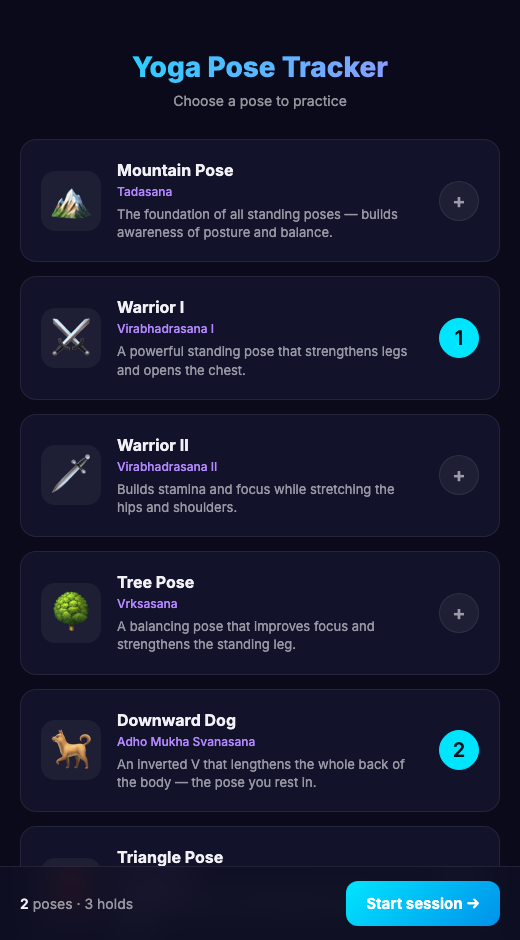
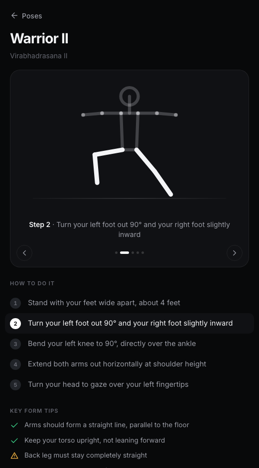

# Yoga Pose Tracker

A browser-based yoga assistant. It shows you how to do a pose, then watches you
through your phone camera and coaches you through holding it — out loud, so you
don't have to look at the screen while you're upside down.

Everything runs on the device. No backend, no build step, no upload.

<p align="center">
  
  
</p>

## What it does

- **Learn first.** Every pose opens with an animated stick figure that steps
  through the instructions, lighting up the body part each step is about.
- **Talks to you.** The count-in, one correction at a time, and the hold
  counted down aloud — phrased as things to do ("straighten your front leg"),
  not numbers. Throttled hard: a minute of good practice is a handful of
  sentences and a chime.
- **Holds.** Ten seconds of continuous correctness, with a grace period so one
  bad frame doesn't reset it, finished with a tone.
- **Sessions.** Queue several poses and work through them hands-free. An
  asymmetric pose isn't finished until you've held both sides, and it works out
  which side you're doing rather than asking.
- **Scores where your limbs point, not just how bent they are.** A knee that
  collapses inward, hips that aren't square, an arm swung the wrong way — none
  of which changes a single joint angle, and all of which a teacher would call
  out first.
- **Scores what it can actually see.** A joint that's off-screen is reported
  as unseen; a joint pointing down the camera axis is reported as *can't tell*
  rather than guessed at. The percentage comes with how much of the pose it
  was able to judge.
- **Measures you once.** A short calibration — face the camera, turn side-on —
  gets your bone lengths from two views, so the target outline stops breathing
  as your limbs turn toward the lens.
- **Live outline.** A dashed target rebuilt from your own limb lengths and
  pinned to your hips, so a correct pose lands on top of it. Red where a joint
  is out, green where it isn't.

Six poses: Mountain, Warrior I, Warrior II, Tree, Triangle and Downward Dog.
Adding more is [documented](docs/ADDING_A_POSE.md) and takes one object in one
file.

## Deploying

`yoga_app/` is the whole app. Copy it to any static host — there is nothing to
build and nothing to configure.

| Host | What to do |
|---|---|
| Netlify, Vercel, Cloudflare Pages | Publish directory: `yoga_app` |
| GitHub Pages | Push the contents of `yoga_app/` to a `gh-pages` branch |
| Any web server | Copy `yoga_app/*` into the document root |

Two requirements:

- **It must be served over HTTPS.** Browsers refuse camera access otherwise.
  (`localhost` is exempt, which is why the local server below exists.)
- **Serve the files as they are.** `index.html` imports ES modules by relative
  path; nothing may be bundled, renamed or minified into one file.

A subpath deploy works — `https://example.com/yoga/` is fine. The service
worker registers relative to its own location.

The MediaPipe runtime and the pose model are fetched from public CDNs on first
run (about 9 MB) and cached by the service worker, so later visits start
offline and instantly.

## Running it locally

```
python3 serve.py
```

Serves `yoga_app/` over HTTPS with a self-signed certificate, on port 8443 or
the next free one. Open the printed URL on your phone (same Wi-Fi) and accept
the certificate warning.

Needs `openssl` on the path, which macOS and most Linux distributions have
already. Everything is served no-cache, so an edit shows up on the phone with
an ordinary reload.

## Browsers and devices

It needs a camera, a secure origin, and four things that arrived together in
modern browsers: ES modules, **module workers**, WebAssembly, and the Web
Speech API. Broadly, Chrome or Edge 80+, Safari 15+, Firefox 114+.

Worth knowing:

- **Audio needs a tap first.** Speech and the chime are unlocked by the button
  that starts tracking, because iOS silently refuses both otherwise. On iPhone
  the ringer switch also silences them.
- **The screen wake lock** keeps the display on during a hold. Chrome, Edge and
  Safari 16.4+ have it; Firefox does not, so the screen may sleep mid-pose.
- **A GPU helps a lot.** Inference asks for the GPU delegate and falls back to
  CPU, and the app tells you which one it got and how fast it is running.
  Detection is paced to a rate the device can sustain — 30, 15 or 10 Hz — so a
  slow phone loses detections rather than dropping the whole interface.
- **Either orientation works.** Portrait or landscape; the wide poses suit
  landscape better.

## How it works

Pose detection is [MediaPipe Pose Landmarker](https://ai.google.dev/edge/mediapipe/solutions/vision/pose_landmarker)
running in the browser through WebAssembly, in a worker so inference never
blocks the interface.

Each pose is defined by a *rig* — the direction each body segment points — and
the eight target joint angles are computed from it, so the demo figure, the
target outline and the scoring are all descriptions of one shape. Landmarks are
smoothed with a One Euro filter (low lag while you move, steady while you hold)
and joint angles are measured in MediaPipe's metric 3D world landmarks rather
than in the image, so they describe your body and not its projection.

A single camera cannot see depth, and the app is built around admitting that
rather than guessing. It works out how far off-axis you are standing, and any
joint whose angle would be read mostly off the camera's depth axis is reported
as unmeasurable instead of scored — which also means a pose can declare that it
only makes sense side-on, as Downward Dog does.

`docs/ARCHITECTURE.md` has the full picture, and `docs/LIMITS.md` is an honest
account of what the scoring cannot tell you — including the parts that no
amount of work fixes without a second camera.

## Privacy

Nothing leaves your device. The model runs client-side; no video, no landmarks
and no scores are uploaded, and there is no server to upload them to. The only
thing stored is whether you have turned the voice off and seen the safety
notice, in `localStorage`.

## Tests

```
tests/run.sh      # the scoring core, the coaching policy, the pose schema
tests/smoke.sh    # does pose detection actually run? (needs Chrome and a network)
tests/eval.sh     # pose × fault × severity → score, against a committed baseline
```

The suite runs under Node if you have it and JavaScriptCore's `jsc` if you
don't — the machine this was built on has no Node, and jsc ships with macOS.
The second script exists because the first cannot see a Worker, MediaPipe or
WebGL, and was perfectly green while the landmarker failed to start for the
app's entire history.

Every fixture is synthetic. They prove the math does what it should; they prove
nothing about a real body. `docs/LIMITS.md` is blunt about what that costs.

```
tools/show-pose.sh downdog    # what shape does this rig actually make?
```

## A note on what this is

It compares the shape you make to a target shape. It cannot see pain, it does
not know your body, and it is not a substitute for a teacher. Work inside what
feels easy and come out of anything that hurts.

## License

[MIT](LICENSE).
